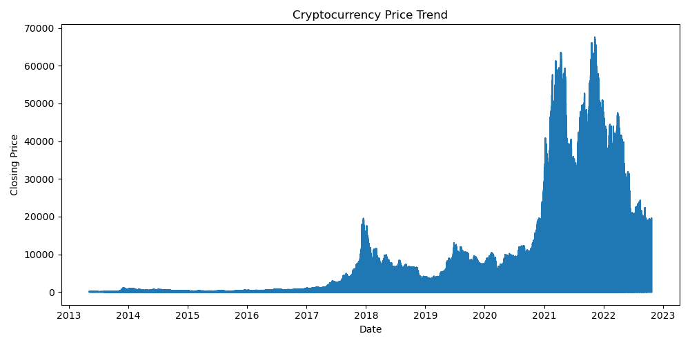
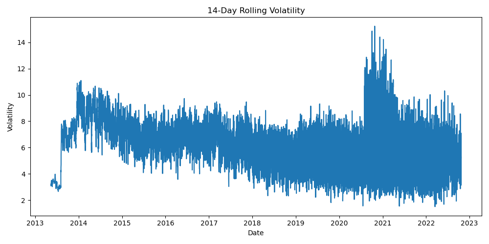
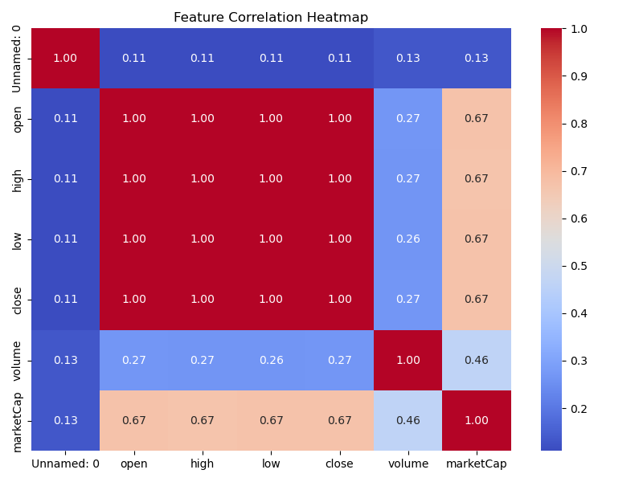

# Cryptocurrency-Volatility-Prediction

# 📈 Cryptocurrency Volatility Prediction using Machine Learning

## 🔍 Project Overview
Cryptocurrency markets are highly volatile, making risk management and decision-making challenging for traders and investors.  
This project aims to **predict cryptocurrency price volatility** using historical market data such as **OHLC prices, trading volume, and market capitalization**.

The model helps in identifying periods of **high market instability**, enabling proactive risk mitigation and better trading strategies.

---

## 🎯 Problem Statement
To build a machine learning model that predicts **future cryptocurrency volatility levels** using historical daily data.

---

## 📊 Dataset Description
The dataset contains historical daily records of multiple cryptocurrencies with the following features:

- Date  
- Symbol  
- Open Price  
- High Price  
- Low Price  
- Close Price  
- Trading Volume  
- Market Capitalization  

---

## ⚙️ Project Workflow

Data Collection
↓
Data Preprocessing
↓
Feature Engineering
↓
Exploratory Data Analysis (EDA)
↓
Model Training
↓
Model Evaluation

---

## 🛠️ Data Preprocessing
- Handled missing values
- Sorted data by date and symbol
- Scaled numerical features using StandardScaler

---

## 🧠 Feature Engineering
The following features were engineered to improve volatility prediction:

- Log Returns
- 7, 14, and 30-day Rolling Volatility
- Liquidity Ratio (Volume / Market Cap)

---

## 📈 Exploratory Data Analysis (EDA)
- Price trend analysis
- Volatility clustering observation
- Correlation analysis between volume, liquidity, and volatility

### 🔹 Price Trend

### 🔹 Rolling Volatility

### 🔹 Correlation Heatmap

---

## 🤖 Model Used
- **XGBoost Regressor**

### Why XGBoost?
- Handles non-linear relationships
- Robust against outliers
- High predictive accuracy

---

## 📏 Model Evaluation Metrics
The model performance was evaluated using:

- Mean Absolute Error (MAE)
- Root Mean Squared Error (RMSE)
- R² Score

The model achieved a strong R² score, indicating good predictive capability.

---

